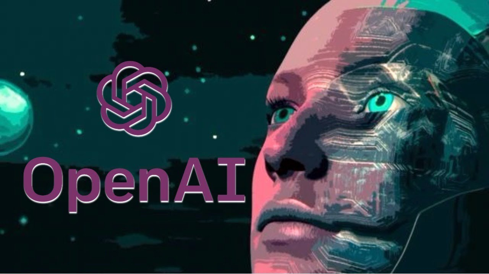
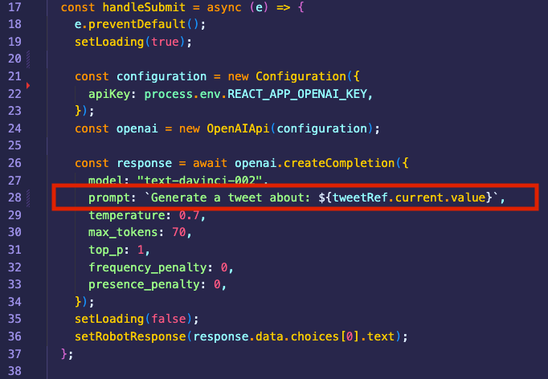

<h1 align="center">OpenAI-Tools</h1>

    
    
    
    

<h3 align="center"><a href="https://open-ai-tools.up.railway.app/">** Click for Live Demo **</a></h3>

## Description

I had some time this past weekend to start playing around with [OpenAI's GPT-3](https://openai.com/api/) and thought it would be fun to build a user-friendly frontend for the playground.

**This app connects to OpenAI's API to generate Product Descriptions, Cold Emails, or make your next Tweet!**

## Demo

    

The home page has a hero banner with a card for each type of request you can make to the AI.

On each page you'll have an input field that, when submitted, connects to the API with request prompt from the page (line 28)

As we await the response with our generated tweet, our robot is removed for a loading spinner which also disappears once the response is received and rendered to the page.
## Technologies
- [Create-React-App](https://create-react-app.dev/docs/getting-started)
- [React Bootstrap](https://react-bootstrap.github.io/components/alerts)
- [React Router](https://reactrouter.com/en/v6.3.0/getting-started/overview)
- [OpenAI API](https://openai.com/api/)
- [Railway](https://railway.app/) - for deployment

## Use
If you clone this repo, you can run it locally using `npm start`